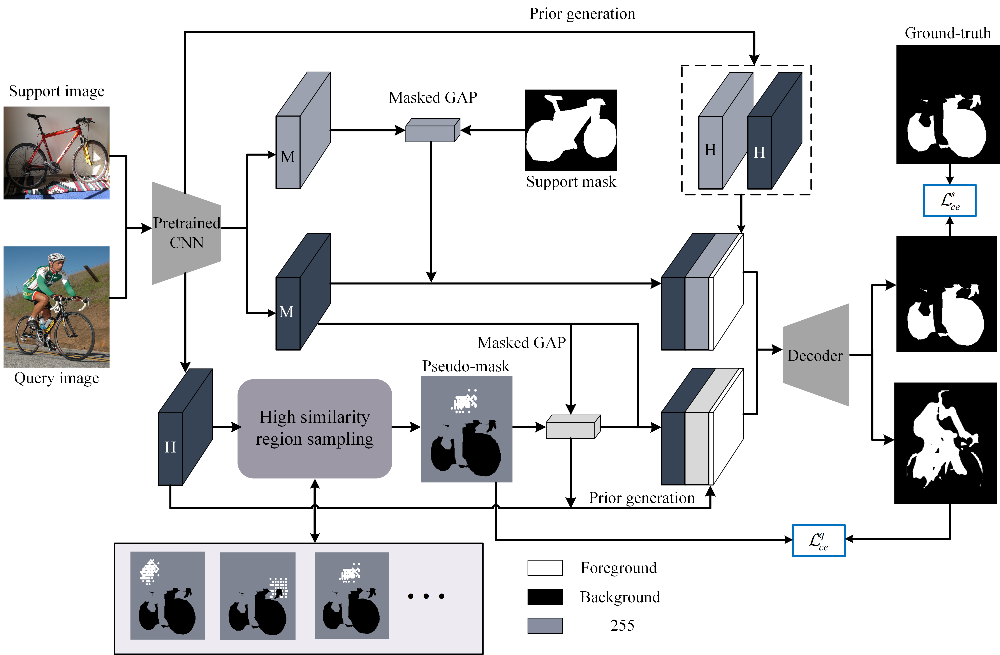

# CELP-Pytorch
This is a PyTorch implementation of CELP for few-shot segmentation

- The pipeline of CELP



- Display of predictions


# Usage

## Environment

```shell
python==3.6.9
GCC=7.5
torch=1.7.1+cu110
torchvision=0.8.2+cu110
pycocotoolssion=2.0.3
cython
tensorboardX
tqdm
PyYAML
opencv-python
```

## Data Preparation

- Pascal-5i: download PASCAL [VOC 2012](http://host.robots.ox.ac.uk/pascal/VOC/voc2012/) and [SBD](http://home.bharathh.info/pubs/codes/SBD/download.html) dataset. For SBD dataset, the val images should be excluded from the list of training samples.
- COCO-20i: download [COCO2014](https://cocodataset.org/#download) dataset, including 2014 train images, 2014 val images, and 2014 Train/Val annotations.  Extract the files in the same directory, and run

```shell
python prepare_coco_data.py
```

## Train

- Create a fold of 'backbones' at the root directory. Download the ImageNet pretrained [backbone](https://mycuhk-my.sharepoint.com/personal/1155122171_link_cuhk_edu_hk/_layouts/15/onedrive.aspx?id=%2Fpersonal%2F1155122171_link_cuhk_edu_hk%2FDocuments%2FPFENet TPAMI Submission%2FPFENet_checkpoints%2Fbackbone.zip&parent=%2Fpersonal%2F1155122171_link_cuhk_edu_hk%2FDocuments%2FPFENet TPAMI Submission%2FPFENet_checkpoints), and put them into the 'backbones' directory.

- For the implementation of CELP with baseline CyCTR, the Deformable DETR dependencies should be built first.

```shell
cd CELP_CyCTR/model/ops/
bash make.sh
```

- Execute the command at the root directory:

```shell
sh train_*.sh {*dataset*} {*model_config*}
```

For example

```shell
sh train_cyctr.sh pascal split0_resnet50
```

```shell
sh train_pfenet.sh pascal split0_resnet50
```

## Run Demo

We provide [pre-trained models](https://nudteducn-my.sharepoint.com/:f:/g/personal/zhaoxiaoyu13_nudt_edu_cn/Ek485pdUfsdBrQ-Zy2z0VsUBTeTVj5lhFquGIB0e007mnQ?e=Asv9lo) on PASCAL-5^i and COCO-20^i for testing. Update the config file by specifying the target split and path of weights. Then execute the command:

```shell
sh test_*.sh {*dataset*} {*model_config*}
```

For example

```shell
 sh test_cyctr.sh pascal split0_resnet50
```

# Acknowledgement

The project is built upon [PFENet](https://github.com/dvlab-research/PFENet), [CyCTR](https://github.com/YanFangCS/CyCTR-Pytorch), and [Deformable-DETR](https://github.com/fundamentalvision/Deformable-DETR).

- PFENet: https://github.com/dvlab-research/PFENet
- CyCTR: https://github.com/YanFangCS/CyCTR-Pytorch
- Deformable-DETR: https://github.com/fundamentalvision/Deformable-DETR

Thank for their excellent works.

# Citation

If you find our codes or models useful, please consider to give us a star or cite with:

```
@misc{zhao2022contrastive,
      title={Contrastive Enhancement Using Latent Prototype for Few-Shot Segmentation}, 
      author={Xiaoyu Zhao and Xiaoqian Chen and Zhiqiang Gong and Wen Yao and Yunyang Zhang and Xiaohu Zheng},
      year={2022},
      eprint={2203.04095},
      archivePrefix={arXiv},
      primaryClass={cs.CV}
}
```
